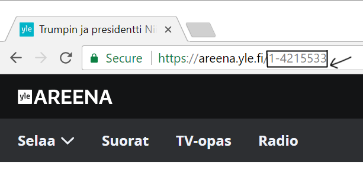

# Yle Areena Embed
Yle Areena Embed

## Usage

### Automatic
See [yle-areena-embed-code-generator](https://theel0ja.github.io/yle-areena-embed-code-generator/)

### Manual

```html
<iframe frameborder="0" allowfullscreen
  src="https://yle-areena-embed.theel0ja.info/index.html?id=VIDEO_ID"
  width="WIDTH" height="HEIGHT"></iframe>
```

Replace `VIDEO_ID`, `WIDTH` and `HEIGHT` with your own values.

#### Where can I find the id?

[](meta/1.png)

## Demo

* [Website](https://theel0ja.github.io/yle-areena-embed/demo)
* [Source code](demo/index.html)
